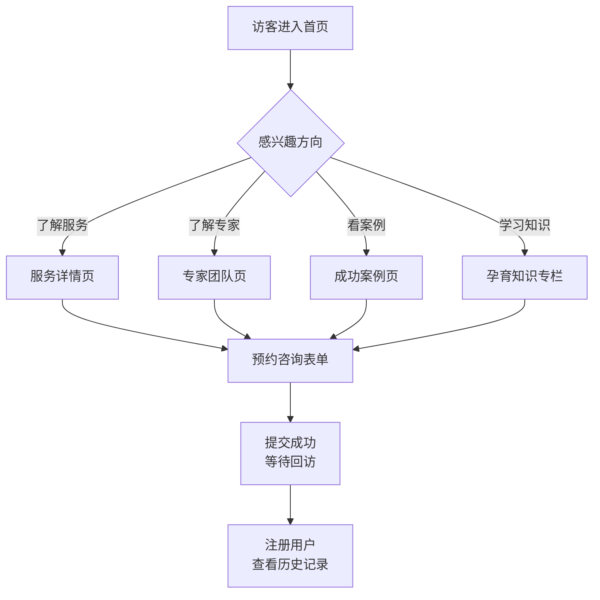

# 蕊安辅助生殖医院网站 - 产品需求文档（PRD）

## 1. 产品概述

蕊安（RUISÉE）是一家专注于辅助生殖与女性孕育健康的国际化专科医院，网站作为品牌形象主入口，承担"传递温暖、专业的孕育希望"的情感与转化双重任务：面向有孕育困扰的夫妇、女性及家庭，提供试管婴儿（IVF）、人工授精（IUI）、胚胎植入前遗传学检测（PGT）、冻卵冻胚、复发性流产诊治、孕前调理与心理支持等全流程服务咨询入口。

目标用户：25–45 岁面临不孕、备孕、冻卵需求的女性及其伴侣；高净值家庭；LGBTQ+ 家庭；海外医疗咨询客户。

## 2. 核心功能

### 2.1 用户角色

| 角色 | 注册方式 | 核心权限 |
|------|----------|----------|
| 访客（未注册） | 无需注册 | 浏览全部内容、提交咨询预约、查看专家与案例 |
| 注册用户 | 手机号 / 邮箱注册 | 查看完整成功案例、收藏文章、预约提醒、咨询历史 |
| 会员客户 | 线下建档 | 在线查看报告、复诊预约、专属客服、孕育周期日历 |

### 2.2 功能模块

1. **首页**：英雄区、品牌叙事、核心服务概览、专家速览、成功率数据、成功案例轮播、患者证言、FAQ、咨询入口
2. **服务详情页**：试管婴儿/人工授精/冻卵/保胎/遗传咨询/男科等服务卡片、流程图、费用区间、常见问答
3. **专家团队页**：医生档案（头像、职称、专长、从业年限、科研成果、出诊时间）
4. **成功案例页**：按服务类型筛选的孕育故事、治疗周期、时间线
5. **孕育知识专栏**：文章列表、文章详情、备孕日历工具
6. **预约咨询页**：分步表单（服务选择 → 个人信息 → 备孕情况 → 联系方式）、提交反馈
7. **关于蕊安**：医院介绍、环境展示、资质荣誉、媒体合作
8. **联系页**：分院地址、地图、热线、咨询时间

### 2.3 页面细节

| 页面 | 模块 | 功能描述 |
|------|------|----------|
| 首页 | 英雄区 | 全屏沉浸式视觉，柔和渐变与胚胎微距意象，标语与双 CTA（预约咨询 / 了解服务） |
| 首页 | 品牌叙事 | 三段式品牌故事，强调"科技 × 共情 × 隐私" |
| 首页 | 核心服务 | 6 大服务卡片，悬停浮现服务亮点 |
| 首页 | 成功率展示 | 大字号动态数字（按年龄/周期类型） |
| 首页 | 专家速览 | 横向滚动医生卡片 |
| 首页 | 真实故事 | 视频/图文故事轮播 |
| 首页 | 患者证言 | 名人/普通用户证言卡片墙 |
| 首页 | FAQ | 折叠手风琴 |
| 服务详情 | 服务卡片 | 图标 + 名称 + 一句话简介 + 适配人群标签 |
| 服务详情 | 流程图 | 6 步治疗流程可视化时间轴 |
| 服务详情 | 费用区间 | 透明价格区间说明 |
| 专家团队 | 医生档案 | 网格布局，点击展开详情 |
| 成功案例 | 案例列表 | 按服务类型筛选的卡片 |
| 成功案例 | 故事详情 | 长篇图文，叙事结构 |
| 知识专栏 | 文章列表 | 分类筛选、搜索、热门标签 |
| 知识专栏 | 文章详情 | 富文本阅读、目录、相关文章 |
| 预约咨询 | 分步表单 | 4 步进度条、字段校验 |
| 关于蕊安 | 资质 | 荣誉墙、媒体 logo |
| 联系页 | 地图 | 多分院地址卡片、地图标记 |

## 3. 核心流程

### 3.1 访客预约咨询流程
访客进入首页 → 浏览服务/案例/专家 → 点击"立即预约" → 跳转预约表单 → 选择服务类型 → 填写个人信息与备孕情况 → 提交 → 收到确认提示 → 等待回访

### 3.2 用户孕育知识探索流程
访客进入首页 → 点击"孕育知识" → 浏览文章列表 → 关键词搜索/分类筛选 → 打开文章 → 阅读 → 跳转相关服务或预约

## 4. 用户界面设计

### 4.1 设计风格

- **核心定位**：温暖有机 × 医学专业 × 高级编辑感
- **主色**：
  - 主色 暖象牙白 `#F8F4EE`（背景基底）
  - 副色 玫瑰胭脂 `#C97B7B`（主操作、强调）
  - 辅色 暮金 `#B8956A`（点缀、徽章）
  - 深色 墨檀 `#2B2520`（正文、标题）
  - 雾粉 `#E8D5D0`（卡片/区块底色）
- **强调色使用**：胭脂红仅用于核心 CTA、关键数字、激活态，避免大面积铺色
- **按钮风格**：
  - 主按钮：实心胭脂红，圆角胶囊（radius-full），内边距 16/32，hover 时轻微下沉 + 阴影增强
  - 次按钮：墨檀描边 + 透明背景，hover 反白
  - 文字按钮：下划线由左至右展开
- **字体方案**：
  - 标题字体：`Fraunces`（衬线，柔润有温度，带可变字重）
  - 正文字体：`Inter`（注：本项目将替换为更独特的 `Sohne` 风格替代品 `Manrope` 配 `Noto Serif SC` 以兼顾中文美感）
  - 中文标题：`Noto Serif SC`（思源宋体 SC，粗体）
  - 中文正文：`Noto Sans SC`（思源黑体 SC）
  - 数字字体：`Fraunces` 的可变字重（300-900），用于成功率等关键数据
- **布局风格**：
  - 顶部固定导航，磨砂玻璃质感（backdrop-blur）
  - 大量非对称布局，关键模块使用偏移网格、跨栏内容
  - 卡片采用 24-32px 圆角，柔和阴影（无强对比黑色阴影）
  - 段落间留白宽松（行高 1.7-1.9）
- **图标/装饰**：
  - 线条图标使用 `lucide-react`
  - 装饰元素：手绘有机曲线 SVG（叶脉、卵细胞、卵泡意象）、细线分隔、金色细线分割
  - 纹理：纸纹噪点叠加（noise overlay 4-6% 不透明度）

### 4.2 页面设计概览

| 页面 | 模块 | UI 元素 |
|------|------|---------|
| 首页 | 英雄区 | 全屏背景：渐变 + 抽象胚胎/卵细胞 SVG 微距图形 + 噪点纹理；标题左对齐 Fraunces 96px；副标题 18px；双 CTA 胶囊按钮；右下角"向下探索"呼吸动画 |
| 首页 | 品牌叙事 | 三栏非对称布局：大标题居左 5/12 + 内容 6/12 偏移；穿插图片与手写体引言 |
| 首页 | 核心服务 | 6 个服务卡片（3×2 网格），圆角 24px，磨砂白底，悬停浮起 + 胭脂红描边 |
| 首页 | 成功率 | 深色区块，金色大字 120px Fraunces 300weight，伴随呼吸光晕 |
| 首页 | 专家速览 | 横向滚动，3 张可见 + 1/3 露出的"窥探感"；医生卡片 320×420 |
| 首页 | 真实故事 | 大图 + 故事摘要 + 数字（金色）3 栏 |
| 首页 | 患者证言 | 卡片墙 2×3 错落排列，每张卡片含用户头像、引言、城市 |
| 首页 | FAQ | 折叠手风琴，标题 Fraunces 24px，内容 Inter 16px |
| 服务详情 | 流程图 | 6 步水平时间轴，连接线为渐变金色圆点 |
| 专家团队 | 医生档案 | 圆形头像 + 医生名 Fraunces 28px + 职称 Noto Sans SC 14px |
| 成功案例 | 故事详情 | 编辑级排版、首字下沉、左右交替图文 |
| 预约咨询 | 表单 | 4 步进度条，分步切换有左右滑入动画 |

### 4.3 响应式设计

- 桌面优先（1440px / 1920px）
- 平板适配（768–1024px）：网格降为 2 列
- 移动端（< 768px）：单列堆叠，导航变为全屏抽屉；字号按 0.85 比例缩放
- 触摸目标 ≥ 44px
- 图片懒加载，关键视觉使用 srcset

### 4.4 3D 场景指引（不适用）

本项目以高级编辑感 + 流畅微动效为主，不使用 3D 场景。重点使用：
- CSS 动画 + 渐变过渡
- 滚动驱动的渐入、视差
- 文字遮罩动画（mask-image）
- 数字递增计数（IntersectionObserver）
- 鼠标悬停光晕（pointer-follow glow）
