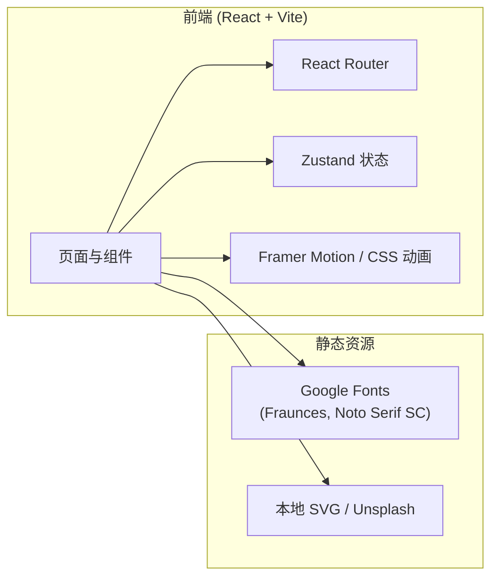

# 蕊安辅助生殖医院网站 - 技术架构文档

## 1. 架构设计



本项目为**纯前端展示型**网站，所有数据使用本地 mock（服务介绍、专家档案、成功案例、文章、FAQ）。预留 mock API 层便于后续接入真实后端。

## 2. 技术栈

- **框架**：React@18 + TypeScript
- **构建工具**：Vite@5
- **样式**：TailwindCSS@3 + CSS Modules（自定义复杂动画）
- **路由**：react-router-dom@6
- **状态管理**：zustand@4（仅用于预约表单多步状态、全局 UI 状态）
- **图标**：lucide-react
- **动效**：framer-motion@11（关键交互） + CSS 关键帧（背景动画、滚动效果）
- **字体**：Google Fonts（Fraunces、Noto Serif SC、Noto Sans SC、Manrope）
- **后端**：无（mock 数据）
- **包管理**：pnpm

## 3. 路由定义

| 路由 | 页面 | 说明 |
|------|------|------|
| `/` | Home | 首页 |
| `/services` | Services | 服务总览 |
| `/services/:slug` | ServiceDetail | 服务详情（ivf / iui / egg-freezing / pgt / 复发性流产 / 孕前调理） |
| `/doctors` | Doctors | 专家团队 |
| `/doctors/:id` | DoctorDetail | 专家详情 |
| `/stories` | Stories | 成功案例列表 |
| `/stories/:id` | StoryDetail | 案例详情 |
| `/journal` | Journal | 孕育知识专栏列表 |
| `/journal/:id` | ArticleDetail | 文章详情 |
| `/about` | About | 关于蕊安 |
| `/contact` | Contact | 联系/分院 |
| `/booking` | Booking | 预约咨询（分步表单） |
| `*` | NotFound | 404 |

## 4. 目录结构

```
.
├── public/
│   └── images/             # 静态图片
├── src/
│   ├── components/
│   │   ├── layout/         # Navbar, Footer, PageShell
│   │   ├── home/           # 首页专用组件 Hero, ServiceGrid, Stats, Doctors, Stories, Testimonials, FAQ
│   │   ├── booking/        # 预约表单分步
│   │   └── ui/             # Button, Card, Badge, Reveal, etc.
│   ├── pages/              # 路由页面
│   ├── data/               # mock 数据（services, doctors, stories, articles, faq, testimonials）
│   ├── hooks/              # useReveal, useCountUp, useScrollProgress
│   ├── store/              # zustand stores
│   ├── styles/             # 全局 CSS、Tailwind 入口
│   ├── utils/              # 工具函数
│   ├── App.tsx
│   └── main.tsx
├── .trae/documents/
├── index.html
├── package.json
├── tailwind.config.js
└── vite.config.ts
```

## 5. 组件设计要点

- **Navbar**：滚动后切换为磨砂玻璃 + 阴影；Logo + 菜单 + 预约 CTA
- **Hero**：全屏渐变 + 抽象卵细胞 SVG（多层动画） + Fraunces 大标题 + 双 CTA
- **ServiceCard**：悬停时描边颜色变化 + 轻微浮起 + 内部图标渐变
- **StatCounter**：IntersectionObserver 触发数字递增，使用 ease-out 曲线
- **DoctorCard**：圆形头像 + 姓名 + 职称 + 悬停展示简介
- **StoryCard**：编辑级排版 + 大图 + 摘要
- **FAQAccordion**：使用 `<details>` + 自定义样式 + 平滑展开动画
- **BookingForm**：4 步进度条 + 左右滑入切换 + 字段实时校验
- **Reveal**：包装组件，IntersectionObserver 触发渐入 + 轻微上移

## 6. 数据模型（mock）

```typescript
// Service
interface Service {
  slug: string;
  name: string;
  shortDesc: string;
  longDesc: string;
  icon: string;
  suitableFor: string[];
  process: { step: number; title: string; desc: string }[];
  priceRange: { min: number; max: number; unit: string };
  successRate: number;
  faqs: { q: string; a: string }[];
}

// Doctor
interface Doctor {
  id: string;
  name: string;
  title: string;
  specialty: string[];
  years: number;
  avatar: string;
  bio: string;
  achievements: string[];
  schedule: string;
}

// Story
interface Story {
  id: string;
  title: string;
  couple: string;
  service: string;
  duration: string;
  summary: string;
  content: string;
  cover: string;
  year: number;
}

// Article
interface Article {
  id: string;
  title: string;
  category: string;
  excerpt: string;
  content: string;
  cover: string;
  author: string;
  date: string;
  readTime: number;
}

// FAQ
interface FAQ {
  id: string;
  question: string;
  answer: string;
  category: string;
}

// Testimonial
interface Testimonial {
  id: string;
  name: string;
  city: string;
  quote: string;
  avatar: string;
  service: string;
}
```

## 7. 关键交互与动画

- 滚动进入：IntersectionObserver 触发 `opacity 0→1` + `translateY 24px→0`，stagger delay 80ms
- 数字递增：requestAnimationFrame 实现 ease-out，2 秒
- 背景渐变：CSS @keyframes 缓慢漂移（30s loop）
- 鼠标光晕：自定义 `cursor-glow` 元素，pointer-follow，`mix-blend-mode: soft-light`
- 文字遮罩：标题使用 `background-clip: text` + 渐变描边，scroll 驱动 background-position
- 表单切换：framer-motion `AnimatePresence` + x: ±40 滑入

## 8. 性能与可访问性

- 字体子集化（仅加载必要字符）
- 图片懒加载 + WebP
- 路由级代码不分割（页面数量有限，避免 lazy 复杂度）
- 语义化 HTML、aria-label、键盘可达
- 颜色对比度满足 WCAG AA
- prefers-reduced-motion 媒体查询禁用大幅动画

## 9. 部署与启动

- 开发：`pnpm dev`
- 构建：`pnpm build`
- 预览：`pnpm preview`
- 端口：5173（Vite 默认）

## 10. 后续扩展（暂不实现）

- 接入真实预约后端 API
- 多语言切换（中/英）
- 会员中心与报告查看
- 在线问诊 IM
- 备孕周期日历工具
